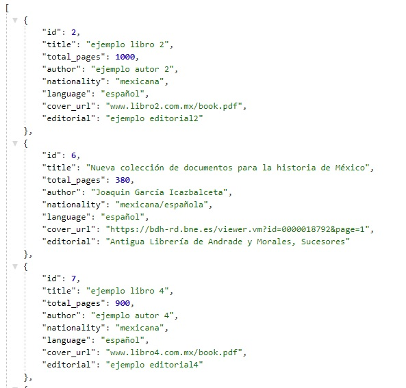

# DevF Kata JavaScript Avanzado Proyecto "Api en Express"

## Contenido

1. [Descripción](#descripcion)
2. [Previa](#previa)
3. [Metodos](#metodos)
4. [Get](#get)
5. [Post](#post)
6. [Put](#put)
7. [Delete](#delete)

### Descripcion
Creamos una API REST usando Node.js, el framework web Express y el sistema gestor de bases de datos MySQL, con los métodos HTTP GET, POST, PUT y DELETE. Realizamos la  prueba de funcionamiento utilizando un cliente REST en Postman ademas de un despliegue en 'Heroku'.

### Tecnologias utilizadas:
 

### Previa
Para instalar los paquetes de Node.js necesarios (indicados en package.json):

- ```npm i```

Crea y asigna tus variables de entorno dentro del archivo .env (en la raíz del proyecto):

- ```HOST=host```

- ```DATABASE=database```

- ```USER=user```

- ```PASSWORD=password```

<hr/>

## Metodos
Demostracion de cada una de las peticiones para probar en Postman (localhost y heroku) o en el navegador como localhost y en dashboard de heroku.

### GET
Para obtener todos los libros disponibles usamos:
- **GET** https://sheltered-garden-91067.herokuapp.com/api/books/
- **GET** http://localhost:4000/api/books/

Si desea encontrar la información un libro en especifico solo agregamos el **ID** en la petición:
- **GET** https://sheltered-garden-91067.herokuapp.com/api/books/(ID)
- **GET** http://localhost:4000/api/books/(ID)

### POST
Podemos agregar un nuevo libro con la petición de **POST**, solo asegurese de llenar todos los datos solicitados correctamente:

1. title: titulo del libro.
2. total_pages (numero entero): número de paginas del libro.
3. author: Autor del libro.
4. nationality: nacionalidad del autor.
5. language: lenguaje en que fue escrito el libro.
6. cover_url: enlace de la portada del libro.
7. editorial: nombre de la editorial que publico el libro.

Es necesario que la informacion este en formato JSON, ejemplo:
```json
{  
        "title": "ejemplo libro 2",
        "total_pages": 1000,
        "author": "ejemplo autor 2",
        "nationality": "mexicana",
        "language": "español",
        "cover_url": "www.libro2.com.mx/book.pdf",
        "editorial": "ejemplo editorial2"
    
}
```
- **POST** https://sheltered-garden-91067.herokuapp.com/api/books/
- **POST** http://localhost:4000/api/books/

### PUT
Si desea editar la información de algun video ya publicado utilice la petición **PUT**. Debera incluir el **ID** unico del LIBRO y la información a editar.
Ejemplo formato JSON para editar informacion:
```json
{
    "total_pages": 1000,
}
```
- **PUT** https://sheltered-garden-91067.herokuapp.com/api/books/(ID)
- **PUT** http://localhost:4000/api/books/(ID)

### DEL
Para eliminar por completo un LIBRO basta con utilizar la petición **PUT**, especificando el **ID** del libro a eliminar.
- **DELETE** https://sheltered-garden-91067.herokuapp.com/api/books/(ID)
- **DELETE** http://localhost:4000/api/books/(ID)

### Previzualizacion de uso
- Peticion Get dashbord Heroku (Navegador)

